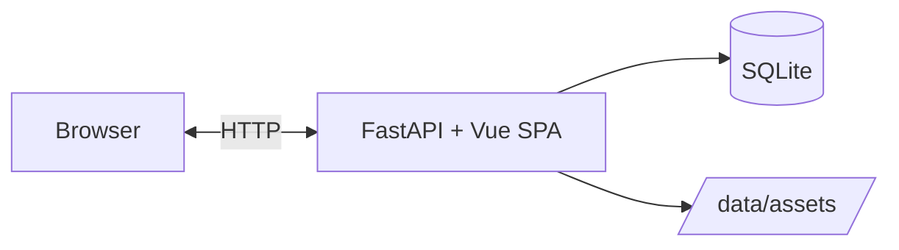

<div align="center">

# Handin

**A simple hand-in page builder, made for Utrecht University.**

[](https://github.com/JustinZeus/handin-website/actions/workflows/ci.yml)
[](https://hub.docker.com/r/justinzeus/handin)
[](https://python.org)

</div>

---

## What is this?

I built this as a boilerplate for group hand-ins at Utrecht University. It lets you combine PDFs, video, audio, markdown, embedded content, and image galleries into a single web page. I'm making it publicly available in case anyone else finds it useful.

## Features

- **Multimodal content** — markdown, PDF, video, audio, iframes, image galleries, and links
- **Drag-and-drop ordering** — reorder segments visually
- **Token-based admin** — single admin token, no user accounts needed
- **Dark mode** — automatic dark/light theme
- **Zero-config database** — SQLite with WAL mode, no external DB to manage
- **Single container** — FastAPI backend + Vue 3 SPA ship as one Docker image

## Quick Start

```bash
git clone https://github.com/JustinZeus/handin-website.git
cd handin-website
cp .env.example .env
# Edit .env and set HANDIN_ADMIN_TOKEN to something secure
docker compose up -d
```

The app listens on port 8000 inside the container. Wire it through your reverse proxy (e.g. Caddy) to expose it.

## How It Works



The Vue 3 frontend is built at image build time and served as static files by FastAPI. All data (database + uploaded assets) lives in a single `/data` volume.

## Configuration

| Variable | Default | Description |
|----------|---------|-------------|
| `HANDIN_ADMIN_TOKEN` | *required* | Bearer token for admin endpoints |
| `HANDIN_SITE_TITLE` | `Untitled Site` | Page title |
| `HANDIN_DATA_DIR` | `./data` | SQLite DB + uploaded assets directory |
| `HANDIN_MAX_UPLOAD_BYTES` | `100000000` | Max file upload size (~100 MB) |
| `HANDIN_ALLOWED_UPLOAD_TYPES` | `pdf,png,jpg,...` | Comma-separated allowed file extensions |

## Tech Stack

| Layer | Technology |
|-------|------------|
| Backend | Python 3.12, FastAPI, Pydantic v2, SQLite |
| Frontend | TypeScript, Vue 3, Vite, Tailwind CSS v4 |
| Infrastructure | Multi-stage Docker, Docker Compose, UV |

## Development

```bash
# Backend
uv sync --group dev
uv run ruff check backend/
uv run ruff format --check backend/
uv run mypy
uv run pytest

# Frontend
cd frontend
npm ci
npx vue-tsc --noEmit
npm run dev
```
